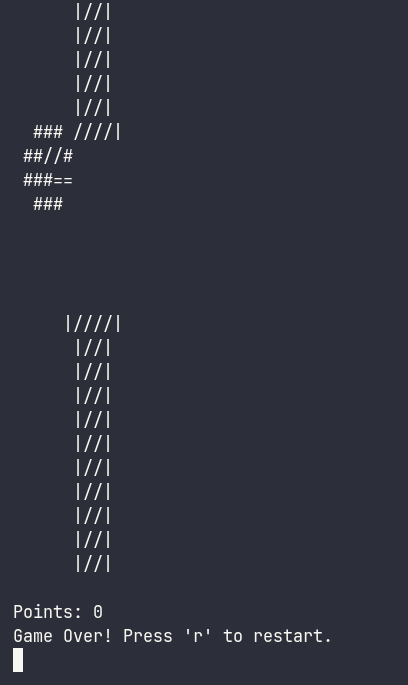

<!-- Ad Maiorem Dei Gloriam! -->
# AsciiBird

A simple terminal game made for Hack Club. Flappy Bird on the terminal!

## Technologies
For this project, i used raw C++ with some legacy C concepts. I handled with references and Buffers (the sprite copying was my favorite thing to handle).
I also developed a small parser for a text-based file format (`.ascii`).
- C/C++
- Termios UNIX API / Conio.h WINDOWS API
- Cross Compilation

## Controls
r - Restarts the level
space - Jumps

## Features
- Custom fps based on the OS sleep
- Sprite loading from file
- Modularity

## How to build
Requires:
    - CMAKE 3.10
    - A C++ compiler

1. Clone the repository with `git clone https://github.com/Renan-G-projec/AsciiBird.git && cd AsciiBird`.
2. Run `cmake -B build && cmake --build build` to compile the binary.
3. Run the program with `./AsciiBird` (Unix) or `./AsciiBird.exe` (Windows).

And that's it.

## I do not want to run the binary
Is totally comprehensible if you don't want to build the app from source or download the binary from the releases page, You can see the devlogs with some videos [Here](https://stardance.hackclub.com/projects/27263).